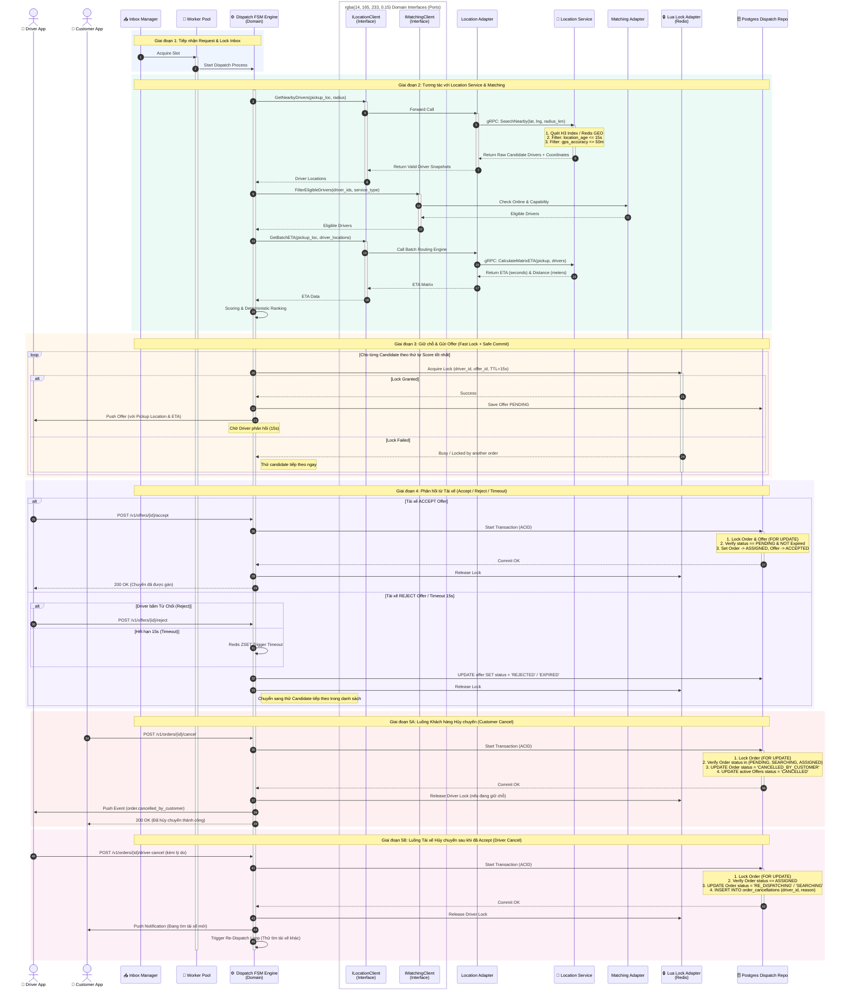

```mermaid
graph TB
    %% Styling Classes for High Contrast
    classDef inbound fill:#0284c7,stroke:#0369a1,stroke-width:2px,color:#ffffff
    classDef concurrency fill:#d97706,stroke:#b45309,stroke-width:2px,color:#ffffff
    classDef core fill:#16a34a,stroke:#15803d,stroke-width:2px,color:#ffffff
    classDef port fill:#059669,stroke:#047857,stroke-width:1.5px,color:#ffffff
    classDef speed fill:#dc2626,stroke:#b91c1c,stroke-width:2px,color:#ffffff
    classDef persist fill:#7c3aed,stroke:#6d28d9,stroke-width:2px,color:#ffffff
    classDef db fill:#4c1d95,stroke:#3b0764,stroke-width:2px,color:#ffffff
    classDef ext fill:#475569,stroke:#334155,stroke-width:2px,color:#ffffff

    subgraph P1["1. Inbound Adapters (Interfaces)"]
        RestHandler["REST Offer API Handler"]
        KafkaConsumer["Kafka Consumer Handler"]
    end

    subgraph P2["2. Concurrency & Protection Layer"]
        InboxMgr["Inbox Manager"]
        WorkerPool["Worker Pool Semaphore"]
    end

    subgraph P3["3. Core Domain Layer (Pure Business Logic)"]
        FSM["Dispatch FSM Engine"]
        RetryEngine["Retry & Radius Engine"]
        ScoringEngine["Scoring & Strategy Engine"]

        subgraph Ports["Domain Interfaces (Ports)"]
            IMatchingClient["IMatchingClient"]
            ILocationClient["ILocationClient"]
            ILockManager["ILockManager"]
            ITimeoutRegistry["ITimeoutRegistry"]
            IDispatchRepo["IDispatchRepository"]
            IEventPublisher["IEventPublisher"]
        end
    end

    subgraph P4["4. Speed & State Engine (Redis Adapters)"]
        LuaLock["Lua Lock Adapter"]
        ZSetTimer["ZSET Timer Worker Adapter"]
    end

    subgraph P5["5. Persistence & Infrastructure Adapters"]
        MatchingAdapter["Matching Client Adapter"]
        LocationAdapter["Location Client Adapter"]
        PostgresRepo["Postgres Dispatch Repository"]
        InboxRepo["Postgres Inbox Repository"]
        KafkaProducer["Kafka Event Producer Adapter"]
    end

    subgraph PostgresDB["PostgreSQL (dispatch_db)"]
        InboxTable["inbox table"]
        OrdersTable["orders / offers / assignments"]
    end

    subgraph RedisDB["Redis Cluster"]
        DriverLock["driver:{id}:lock"]
        TimeoutsZSet["dispatch:timeouts (ZSET)"]
    end

    ExtMatchingSvc["Matching Service"]
    ExtLocationSvc["Location Service"]

    %% Class Assignments
    class RestHandler,KafkaConsumer inbound
    class InboxMgr,WorkerPool concurrency
    class FSM,RetryEngine,ScoringEngine core
    class IMatchingClient,ILocationClient,ILockManager,ITimeoutRegistry,IDispatchRepo,IEventPublisher port
    class LuaLock,ZSetTimer speed
    class MatchingAdapter,LocationAdapter,PostgresRepo,InboxRepo,KafkaProducer persist
    class InboxTable,OrdersTable,DriverLock,TimeoutsZSet db
    class ExtMatchingSvc,ExtLocationSvc ext

    %% Subgraph Styling
    style P1 fill:#0284c715,stroke:#0284c7,stroke-width:2px
    style P2 fill:#d9770615,stroke:#d97706,stroke-width:2px
    style P3 fill:#16a34a15,stroke:#16a34a,stroke-width:2px
    style Ports fill:#05966920,stroke:#059669,stroke-width:1.5px
    style P4 fill:#dc262615,stroke:#dc2626,stroke-width:2px
    style P5 fill:#7c3aed15,stroke:#7c3aed,stroke-width:2px
    style PostgresDB fill:#4c1d9515,stroke:#4c1d95,stroke-width:2px
    style RedisDB fill:#dc262615,stroke:#dc2626,stroke-width:2px

    %% Domain Connections
    FSM -->|"Calculate Radius & Retry"| RetryEngine
    FSM -->|"Score Candidates & Select Strategy"| ScoringEngine
    FSM -->|"FilterEligibleDrivers()"| IMatchingClient
    FSM -->|"GetNearbyDrivers() & GetBatchETA()"| ILocationClient
    FSM -->|"Fast Acquire Lock"| ILockManager
    FSM -->|"Schedule 15s Timer"| ITimeoutRegistry
    FSM -->|"Persist Offer/Assignment"| IDispatchRepo
    FSM -->|"Publish Outbound Events"| IEventPublisher

    %% Implementation Connections
    MatchingAdapter -.->|implements| IMatchingClient
    LocationAdapter -.->|implements| ILocationClient
    LuaLock -.->|implements| ILockManager
    ZSetTimer -.->|implements| ITimeoutRegistry
    PostgresRepo -.->|implements| IDispatchRepo
    KafkaProducer -.->|implements| IEventPublisher

    %% Outbound Infrastructure Connections
    MatchingAdapter -->|"HTTP / gRPC Call"| ExtMatchingSvc
    LocationAdapter -->|"gRPC GeoSearch & Routing ETA"| ExtLocationSvc
    LuaLock -->|"Exec Lua Scripts"| RedisDB
    ZSetTimer -->|"ZADD / ZPOPMIN"| RedisDB
    PostgresRepo -->|"ACID Transaction"| PostgresDB
```

## **1. Bảng Chi tiết các Component (Updated)**

| Layer | Component | Nhiệm vụ & Logic nghiệp vụ |
| :---- | :---- | :---- |
| **1. Inbound Adapters** | **REST Offer API** | Nhận request Accept/Reject trực tiếp từ Driver App (Synchronous), trả về phản hồi tức thì. |
|  | **Kafka Consumer** | Lắng nghe event booking.created.v1, booking.cancelled.v1 để kích hoạt luồng điều phối. |
| **2. Concurrency & Protection** | **Inbox Manager** | Chống xử lý trùng (Idempotency). Ghi message_id vào Postgres Inbox table (PROCESSING). Nếu trùng trả lỗi ngay. |
|  | **Worker Pool (Semaphore)** | Giới hạn số Goroutine đồng thời (NumCPU × 2). Tránh trễ/sập hệ thống khi có 10.000 booking đến cùng lúc. |
| **3. Core Domain (Pure Logic)** | **Dispatch FSM Engine** | Quản lý State Machine (CREATED → SEARCHING → OFFERED → ASSIGNED/FAILED). Điều phối toàn bộ luồng. |
|  | **Retry & Radius Engine** | Quản lý tăng bán kính (3 km → 5 km → 8 km) và thứ tự thử lại candidate (candidate_index). |
|  | **Scoring & Strategy Engine** | Chấm điểm phi tuyến, áp dụng boost theo bối cảnh, chọn chiến lược Greedy hoặc Batch Matching và sắp xếp candidate deterministic. |
|  | **Domain Interfaces** | Các hợp đồng abstract: IMatchingClient, **ILocationClient**, ILockManager, ITimeoutRegistry, IDispatchRepository. |
| **4. Speed Engine (Redis)** | **Lua Lock Adapter** | Chạy Lua script atomic: Khóa tài xế tạm thời trong RAM, đảm bảo 2 đơn không thể giữ chung 1 tài xế. |
|  | **ZSET Timer Adapter** | Đăng ký đếm ngược 15s (ZADD). Worker dùng thuật toán Score-Peek Adaptive Sleep để quét timeout không tốn CPU. |
| **5. Persistence (Postgres)** | **Dispatch Repository** | Ghi bền vững trạng thái Offer, Order, Assignment xuống Postgres. |
|  | **Outbox Repository** | Lưu sự kiện Outbox trong cùng Transaction để gửi Kafka an toàn (Transactional Outbox Pattern). |
| **6. Outbound Adapters** | **Matching Adapter** | Gọi HTTP/gRPC sang Matching Service kiểm tra trạng thái Online, Capability & Service Type của tài xế. |
|  | **Location Adapter** | Gọi gRPC sang **Location Service** để quét vị trí xung quanh (Spatial Index H3/Redis GEO), lọc GPS chất lượng và tính toán **Batch ETA đường bộ**. |
|  | **Kafka Producer** | Bắn các event outbound: dispatch.offer.pushed, dispatch.offer.accepted, dispatch.no_driver. |

## **2. Logic Nghiệp vụ Chi tiết (End-to-End Flow - Updated)**

### **Giai đoạn 1: Tiếp nhận Request & Bảo vệ Concurrency**

1. **Inbox Check:** Request/Event đi vào Inbox Manager → Insert vào bảng inbox trong Postgres với trạng thái PROCESSING.  
   * *Nếu đã tồn tại:* Chặn ngay lập tức (Chống Kafka retry trùng hoặc Tài xế spam click Accept).  
2. **Semaphore Slot:** Goroutine xin 1 slot từ Worker Pool. Nếu hết slot, request đứng chờ ở hàng đợi bộ nhớ.

### **Giai đoạn 2: Quét Vị trí, Matching, Tính Batch ETA & Scoring**

Luồng xử lý tại Giai đoạn 2 được chia làm 4 bước nghiêm ngặt:

```text
[1. Geo-Search & GPS Filter] ──► [2. Capability Filter] ──► [3. Batch ETA Routing] ──► [4. Scoring & Rank]  
  (Location Service)               (Matching Service)         (Location Service)          (Dispatch FSM)
```

1. **Step 2a — Geo Search & GPS Quality Filter (ILocationClient):**  
   * FSM chuyển trạng thái Order sang DISPATCHING.  
   * Gọi `ILocationClient.GetNearbyDrivers(pickup_loc, radius)` → Location Service quét Spatial Index (H3 Cell / Redis GEO).  
   * Location Service chỉ trả danh sách ứng viên vị trí hợp lệ, ưu tiên tối đa khoảng 20 candidate gần nhất theo Haversine để giảm tải scoring phía Dispatch.  
   * **Hard Filter tại Location Service:** Loại bỏ ngay các tài xế có GPS không đạt chuẩn:  

$$
\text{location\_age} > 15\text{ giây} \quad \text{hoặc} \quad \text{gps\_accuracy} > 50\text{ mét}
$$

2. **Step 2b — Capability & Status Filter (IMatchingClient):**  
   * FSM lấy danh sách driver_id hợp lệ vị trí gửi sang `IMatchingClient.FilterEligibleDrivers()`.  
   * **Hard Filter tại Matching Service:** Loại bỏ tài xế offline, đang BUSY, bị khóa tài khoản, hoặc không hỗ trợ service_type của chuyến đi.  
3. **Step 2c — Batch ETA Calculation (ILocationClient):**  
   * FSM gửi tọa độ điểm Pickup và danh sách tài xế còn lại sang `ILocationClient.GetBatchETA()`.  
   * Location Service gọi Routing Engine (OSRM / GraphHopper) tính toán ma trận thời gian di chuyển qua đường bộ (Routing Matrix) thay vì khoảng cách đường thẳng.  
4. **Step 2d — Deterministic Scoring & Ranking:**  
   * FSM gọi Scoring & Strategy Engine để chấm điểm từng ứng viên theo mô hình phi tuyến Reciprocal Decay:  

$$
\text{Score} = \left( \frac{100}{1.0 + \alpha \cdot t_{ETA}} \right) \cdot \left[ w_1 \cdot \left(\frac{R_{star}}{5.0}\right)^2 + w_2 \cdot \left(\frac{AR}{100}\right) + w_3 \cdot \left(\frac{CoR}{100}\right) \right] + S_{boost}
$$

   * Trong đó `t_ETA` và `d_road` lấy từ Batch ETA của Location Service; `R_star`, `AR`, `CoR`, `t_idle`, số dư ví và tier lấy từ Matching/Profile context.
   * `S_boost = S_aging + S_VIP + S_idle_fifo + P_revenue`, dùng cho đơn chờ lâu, khách VIP, tài xế rảnh lâu và đơn giá trị cao.
   * Sắp xếp danh sách tài xế theo Score DESC (điểm cao nhất = ưu tiên cao nhất). Nếu bằng điểm, tie-break theo ETA đường bộ ngắn hơn → idle time lâu hơn → số dư ví lớn hơn → driver_id ASC để đảm bảo deterministic.

#### **Mô hình thuật toán tích hợp trong Dispatch**

`dispatch-svc` sở hữu toàn bộ quyết định chấm điểm và chọn tài xế. `location-svc` không quyết định ai được nhận đơn; service này chỉ chuẩn hóa vị trí, lọc GPS, trả nearby candidates và cung cấp Batch ETA đường bộ.

Các nhóm tham số cơ bản:

| Nhóm | Tham số chính | Nguồn dữ liệu |
| :---- | :---- | :---- |
| Không gian & giao thông | `t_ETA`, `d_road`, heading, barrier/one-way nếu routing provider có hỗ trợ | Location Service / Routing Engine |
| Chất lượng tài xế | `R_star`, `AR`, `CoR`, tier, số chuyến, cảnh báo gần đây | Matching/Profile context |
| Công bằng phân phối | `t_idle`, số lần bị skip, cooldown/retry history | Dispatch state / Matching context |
| Trạng thái đơn hàng | `t_wait`, service_type, customer tier, `V_fare` | Booking payload |
| Kinh doanh | `P_revenue`, số dư ví ký quỹ, commission/cash-trip risk | Account/Profile context |

Chiến lược phân bổ:

| Bối cảnh | Chiến lược | Quy tắc chính |
| :---- | :---- | :---- |
| Bình thường / thừa xe | Greedy Single-Assignment | Chọn Rank 1 theo Score DESC và gửi offer ngay. |
| Cao điểm / nhiều đơn cùng ô H3 | Windowed Bipartite Matching | Gom đơn trong cửa sổ 2-3 giây theo H3 cell, tối đa hóa tổng Score vùng rồi phát offer theo kết quả matching. |
| Mưa lớn / cực thiếu xe | Batch Matching + Priority Boost | Tăng trọng số `C_vip`, `t_wait`, `P_revenue`; có thể kéo dài cửa sổ gom đơn tới 5 giây. |
| Ngoại thành / thưa xe | Dynamic Radius + MinScore Decay | Mở rộng bán kính 3 km → 5 km → 8 km và giảm ngưỡng điểm tối thiểu theo attempt. |
| Đơn giá trị cao / khách VIP | Filtered Greedy | Áp quality gate trước khi scoring, ví dụ rating và completion rate tối thiểu theo service type. |

Tham số theo loại dịch vụ:

| Tham số | Bike | Car |
| :---- | :---- | :---- |
| `alpha_ETA` | 0.008 | 0.003 |
| Trọng số heading | Thấp, vì xe máy dễ quay đầu hơn | Cao, vì ô tô nhạy với đường một chiều, cầu vượt và dải phân cách |
| Barrier/one-way penalty | Có thể nhẹ hoặc bỏ qua ở bản đầu | Nên bật khi routing provider trả đủ dữ liệu |
| Ngưỡng đơn giá trị cao | Từ khoảng 100.000 VNĐ | Từ khoảng 300.000 VNĐ |

### **Giai đoạn 3: Giữ chỗ kép (Dual-Tier Lock) & Tạo Offer**

```text
[FSM] ────(1) Redis Lua Lock (Fast Path)────► [Redis Cluster] (Khóa tức thì < 2ms)  
  │  
  └───────(2) Save Offer PENDING ───────────► [PostgreSQL]    (Lưu lịch sử & State)  
  │  
  └───────(3) ZADD Timer (15s) ─────────────► [Redis ZSET]     (Đếm ngược Timeout)
```

* **Step 3a — Fast Lock (Redis):** FSM duyệt từng candidate từ top down, thực thi Lua script `acquire_offer_lock.lua`:  
  * Kiểm tra `driver:{id}:lock` trên Redis.  
  * Nếu trống: Set lock thành công với $\text{TTL} = 15\text{s}$.  
  * Nếu đã bị giữ bởi đơn khác: Bỏ qua, thử ngay candidate tiếp theo ($0\text{ ms}$ delay).  
* **Step 3b — Safe Persist (Postgres):** Sau khi giữ chỗ Redis thành công, ghi bản ghi Offer trạng thái PENDING vào Postgres (`expires_at = NOW() + 15s`).  
* **Step 3c — Set Timer & Push:**  
  * Thêm offer_id vào Redis ZSET `dispatch:timeouts` với zset score = Unix Timestamp của `expires_at`.  
  * Bắn Notification/Push Offer tới Driver App (kèm dữ liệu Điểm đón + ETA do Location Service tính toán).

### **Giai đoạn 4: Xử lý Phản hồi từ Tài xế (Accept / Reject / Timeout)**

#### **Kịch bản A: Tài xế bấm ACCEPT (Đồng ý)**

1. **Fast Gate (Redis):** API Handler kiểm tra Quick-Lock trên Redis. Nếu cờ khóa còn hiệu lực, cho phép đi tiếp vào Database.  
2. **Hard Commit (PostgreSQL Transaction):** Mở 1 Postgres Transaction duy nhất và thực thi:  

```sql
-- Lock chặt dòng Order & Offer trong Database  
SELECT * FROM orders WHERE id = :order_id FOR UPDATE;  
SELECT * FROM offers WHERE id = :offer_id AND status = 'PENDING' FOR UPDATE;  

-- Cập nhật trạng thái  
UPDATE offers SET status = 'ACCEPTED' WHERE id = :offer_id;  
UPDATE orders SET status = 'ASSIGNED', driver_id = :driver_id WHERE id = :order_id;  

-- Tạo Assignment và Outbox Event  
INSERT INTO assignments (order_id, driver_id, offer_id) VALUES (...);  
INSERT INTO outbox_events (type, payload) VALUES ('order.assigned', ...);
```

**Clean Up:**

* Commit DB thành công → Giải phóng/Finalize Redis Lock.  
* Cập nhật Inbox status = PROCESSED.  
* Trả kết quả 200 OK ngay lập tức cho Driver App.

#### **Kịch bản B: Tài xế bấm REJECT (Từ chối)**

1. Cập nhật Postgres Offer status = REJECTED.  
2. Xóa Lock trên Redis + Xóa khỏi ZSET Timer.  
3. Thêm driver vào `excluded_driver_ids` của dispatch attempt hiện tại và áp dụng cooldown ngắn khoảng 2 phút để tránh bắn lại cùng đơn.  
4. Kích hoạt FSM thử ngay candidate tiếp theo trong danh sách.

#### **Kịch bản C: Offer hết hạn (TIMEOUT)**

1. **Adaptive Timer Worker** dùng ZPOPMIN lấy các offer_id có zset score $\le \text{NOW()}$.  
2. Mở DB Transaction: Cập nhật Offer status = EXPIRED.  
3. Xóa Lock Redis, thêm driver vào `excluded_driver_ids` của attempt hiện tại và áp dụng cooldown ngắn khoảng 2 phút.  
4. Kích hoạt FSM chọn candidate tiếp theo hoặc tăng bán kính tìm kiếm via Retry & Radius Engine.

#### **Kịch bản D: Không có candidate đạt ngưỡng điểm**

1. Nếu candidate list rỗng hoặc tất cả ứng viên dưới `MinScore`, FSM tăng `attempt++`.  
2. Retry & Radius Engine mở rộng bán kính theo cấu hình 3 km → 5 km → 8 km.  
3. Scoring & Strategy Engine giảm `MinScore` theo từng attempt, ví dụ `attempt 0 = 300`, `attempt 1 = 240`, `attempt 2 = 190`, để tránh trôi đơn ở vùng thưa xe.  
4. Nếu hết attempt vẫn không có tài xế, FSM chuyển Order sang FAILED/NO_DRIVER và phát event `dispatch.no_driver`.

### **Giai đoạn 5: Self-Healing Sweeper (Tự phục hồi)**

* 1 Background Job chạy định kỳ mỗi 10 giây quét bảng inbox và offers:  
  * Nếu ghi nhận inbox record ở trạng thái PROCESSING quá 10 giây (do Pod bị crash giữa chừng): Sweeper sẽ reset hoặc đẩy lại tin nhắn để khôi phục tiến trình.  
  * Nếu phát hiện Lệch dữ liệu (Redis mất Lock nhưng Postgres Offer vẫn PENDING): Sweeper dựa vào Postgres để khôi phục hoặc hủy Offer kẹt.

## **3. Ma trận Bảo vệ Dữ liệu & Concurrency (Updated)**

| Nguy cơ Tranh chấp / Trạng thái kém | Cơ chế Bảo vệ chính | Thành phần đảm nhiệm |
| :---- | :---- | :---- |
| **1 Khách bấm đặt trùng / Spam Request** | Unique Index Key trên Inbox Table | Postgres Inbox Manager |
| **GPS vị trí cũ / Sai lệch khoảng cách** | Hard Filter location_age $\le$ 15s & gps_accuracy $\le$ 50m | Location Adapter / Location Service |
| **ETA không chính xác do đường một chiều/sông** | Lấy ma trận đường bộ Batch Routing ETA thay vì Haversine | Location Service (Routing Engine) |
| **Scoring thay đổi giữa các lần retry** | Lưu scoring snapshot và sort key deterministic vào Offer/Dispatch Attempt | Dispatch Repository |
| **2 Đơn cùng chọn 1 Tài xế cùng lúc** | Redis Lua Script `acquire_offer_lock.lua` | Redis Cluster (Fast Lock) |
| **2 Tài xế cùng Accept 1 Đơn** | Unique Index `uq_active_assignment_order` | Postgres Constraint |
| **Accept và Timeout xảy ra cùng miligiây** | DB Row Lock (FOR UPDATE) trên dòng Offer | Postgres ACID Transaction |
| **Mất mạng / Server Restart đột ngột** | Transactional Outbox + DB `expires_at` | Postgres + Sweeper Job |
| **Nổ tải Goroutines khi Traffic tăng vọt** | Queue giới hạn bằng Channel Semaphore | Worker Pool Manager |
