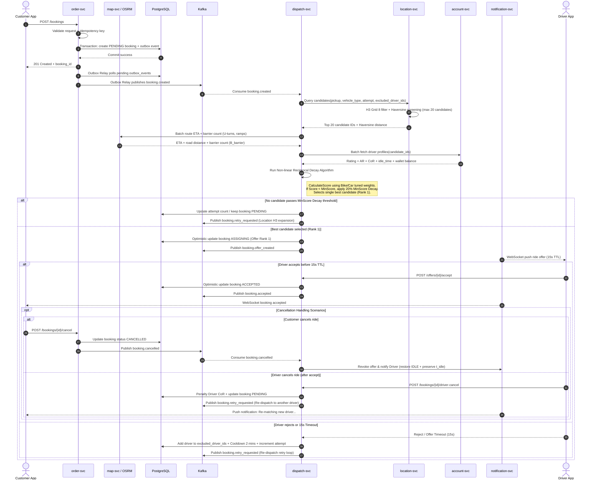

# Báo cáo thiết kế kiến trúc hệ thống BSM (BSM Master Architecture Report)

Tài liệu này trình bày kiến trúc tổng thể và các luồng nghiệp vụ của hệ thống đặt và điều phối xe công nghệ thời gian thực BSM (Backend System for Mobility). Thiết kế tập trung vào tính chịu tải, xử lý đồng thời, tính phi đồng bộ thông qua mô hình Event-Driven Architecture và cơ chế đảm bảo tính nhất quán của dữ liệu.

---

## 1. Sơ đồ tuần tự kiến trúc tổng thể 

Sơ đồ tuần tự dưới đây mô tả luồng chính từ lúc khách hàng tạo booking đến khi hệ thống sinh danh sách ứng viên, chấm điểm thuật toán, gửi lời mời cho tài xế và xử lý kết quả phản hồi. Thứ tự các thành phần được bố trí theo luồng tổng thể: Customer App -> `order-svc` -> `map-svc` -> PostgreSQL -> Kafka -> `dispatch-svc` -> `location-svc` -> `account-svc` -> `notification-svc` -> Driver App.

---

## 2. Mô tả chi tiết kiến trúc tổng thể

Hệ thống **BSM (Backend System for Mobility)** được thiết kế theo mô hình **Microservices kết hợp Event-Driven Architecture (EDA)** nhằm đảm bảo khả năng mở rộng ngang, chịu tải cho 100,000+ tài xế hoạt động đồng thời và duy trì độ trễ thấp ($< 50\text{ms}$).

### 2.1. Phân chia miền dịch vụ (Service Breakdown)

*   **`order-svc` (Dịch vụ quản lý đơn hàng):**
    *   Tiếp nhận yêu cầu đặt xe (`POST /bookings`) từ Customer App.
    *   Kiểm tra tính trùng lặp qua `idempotency_key`.
    *   Thực hiện ghi dữ liệu đơn hàng (`PENDING`) và sự kiện outbox vào **PostgreSQL** trong cùng 1 DB transaction.
    *   **Outbox Relay:** Tiến trình chạy ngầm quét bảng `outbox_events` và phát sự kiện `booking.created` sang Kafka.

*   **`location-svc` (Dịch vụ vị trí & không gian):**
    *   Quản lý vị trí tài xế theo thời gian thực ($10\text{s}$ heartbeat).
    *   Lưu trữ chỉ mục không gian bằng **H3 Hexagonal Grid (Resolution 8)** trong Redis.
    *   Thực hiện lọc nhanh bán kính (Haversine screening) để trả về danh sách ứng viên khả thi ($MAX \le 20$ tài xế).

*   **`map-svc` / OSRM (Dịch vụ bản đồ & định tuyến):**
    *   Tích hợp OSRM (Open Source Routing Machine) để tính toán ma trận ETA đường bộ và khoảng cách di chuyển thực tế.
    *   Phân tích lộ trình `steps` để trích xuất chỉ số **rào cản vật lý ($B_{barrier}$)** như quay đầu xe ($U\text{-turn}$), đường cấm, cầu vượt.

*   **`account-svc` (Dịch vụ quản lý tài khoản & hồ sơ):**
    *   Cung cấp dữ liệu chỉ số tài xế cho thuật toán tính điểm.
    *   Quản lý chỉ số đánh giá ($R_{star}$), tỷ lệ nhận cuốc ($AR$), tỷ lệ hủy cuốc ($CoR$), thời gian rảnh ($t_{idle}$) và kiểm tra số dư ví tài khoản.

*   **`dispatch-svc` (Dịch vụ điều phối & thuật toán):**
    *   Tiêu thụ các sự kiện từ Kafka (`booking.created`, `booking.retry_requested`).
    *   Thực thi **Mô hình chấm điểm phi tuyến suy giảm (Non-linear Reciprocal Decay Model)** kết hợp bộ tham số tinh chỉnh riêng cho dịch vụ **Bike** và **Car**.
    *   Áp dụng quy tắc **MinScore Decay ($20\%$)** khi thưa xe.
    *   Xếp hạng và chọn ra tài xế tốt nhất (Rank 1) để gửi lời mời nhận cuốc.
    *   Quản lý vòng lặp thử lại (`attempt++`) và loại trừ tài xế từ chối (`excluded_driver_ids`).

*   **`notification-svc` (Dịch vụ thông báo thời gian thực):**
    *   Duy trì kết nối **WebSocket** hai chiều tới Customer App và Driver App.
    *   Bắn thông báo lời mời cuốc xe ($15\text{s}$ TTL) tới Driver App và thông báo kết quả ghép xe thành công/thất bại tới Customer App.

### 2.2. Tầng hạ tầng & Lưu trữ (Infrastructure & Data Layer)

*   **Apache Kafka (Event Bus):** Đóng vai trò là xương sống truyền tin phi đồng bộ, giúp tách rời (decouple) các dịch vụ, đảm bảo xử lý sự kiện theo thứ tự và chống mất mát dữ liệu.
*   **PostgreSQL (Primary DB):** Lưu trữ dữ liệu bền vững cho các đơn hàng (`bookings`), lịch sử giao dịch và áp dụng **Transactional Outbox Pattern** để phát sự kiện tin cậy.
*   **Redis Cluster:**
    *   *Spatial Indexing:* Lưu dữ liệu H3 Cell và tọa độ GPS tài xế.
    *   *Distributed Locking:* Áp dụng Redis Lock (`SETNX`) chống xung đột gán đơn đồng thời.

