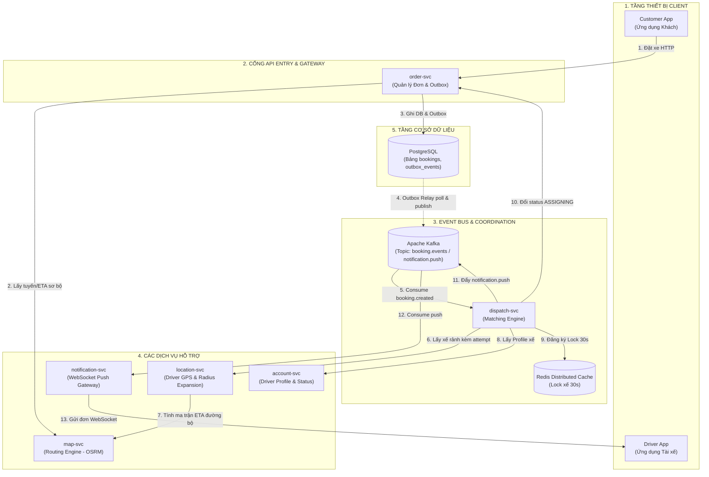
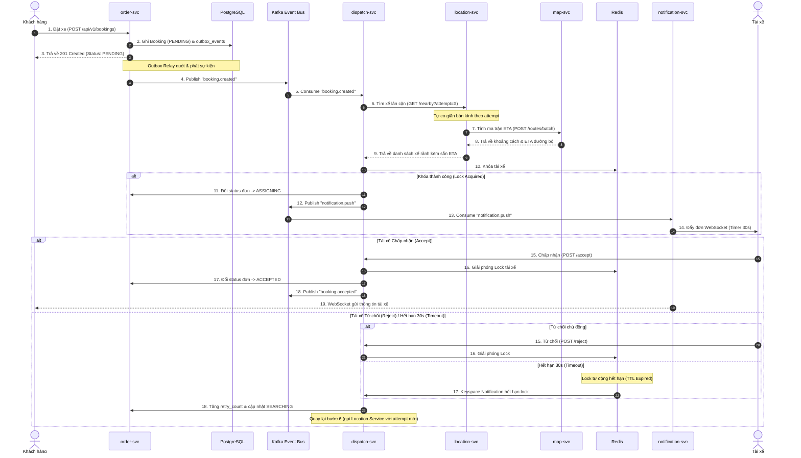

# THIẾT KẾ CHI TIẾT CÁC DỊCH VỤ (SERVICE DESIGN DIAGRAM) - BSM

Tài liệu này mô tả sơ đồ kiến trúc các dịch vụ theo dạng Vi dịch vụ hướng sự kiện (Event-Driven Microservices) được tối ưu hóa cho dự án **BSM (Backend System for Mobility)**.

---

## 1. Sơ Đồ Khối Tầng Dịch Vụ (Service Layer Flowchart)

Sơ đồ thể hiện luồng liên kết và giao tiếp giữa các thành phần phần mềm trong kiến trúc vi dịch vụ:



---

## 2. Sơ Đồ Tuần Tự Tương Tác Chi Tiết (Sequence Diagram)

Quy trình tuần tự xử lý đơn từ lúc khách đặt xe, điều phối tìm tài xế, quản lý khóa giữ xế qua Redis, và xử lý phản hồi/timeout:



---

## 3. Đặc Tả Chi Tiết API & Payload Kết Nối Giữa Các Dịch Vụ

### API 1: Lấy danh sách tài xế kèm ETA (location-svc cung cấp)
*   **Endpoint:** `GET /api/v1/locations/nearby`
*   **Query Parameters:**
    *   `lat`: `21.0285` (Tọa độ đón khách)
    *   `lng`: `105.8542`
    *   `attempt`: `0` (Lượt thử hiện tại để co giãn bán kính)
    *   `vehicle_type`: `motorbike` (Loại xe yêu cầu)
*   **Response Payload (JSON):**
    ```json
    {
      "drivers": [
        { 
          "driver_id": "drv_101", 
          "latitude": 21.0290, 
          "longitude": 105.8550,
          "eta": 90.0,
          "distance_meters": 350.0
        },
        { 
          "driver_id": "drv_102", 
          "latitude": 21.0270, 
          "longitude": 105.8530,
          "eta": 180.0,
          "distance_meters": 620.0
        }
      ]
    }
    ```

### API 2: Tính toán khoảng cách & ETA hàng loạt (giao tiếp nội bộ giữa location-svc và map-svc)
*   **Endpoint:** `POST /api/v1/routes/batch`
*   **Request Payload (JSON):**
    ```json
    {
      "origin": { "latitude": 21.0285, "longitude": 105.8542 },
      "destinations": [
        { "driver_id": "drv_101", "latitude": 21.0290, "longitude": 105.8550 },
        { "driver_id": "drv_102", "latitude": 21.0270, "longitude": 105.8530 }
      ]
    }
    ```
*   **Response Payload (JSON):**
    ```json
    {
      "routes": [
        { "driver_id": "drv_101", "distance_meters": 350.0, "duration_seconds": 90.0 },
        { "driver_id": "drv_102", "distance_meters": 620.0, "duration_seconds": 180.0 }
      ]
    }
    ```

### API 3: Lấy thông tin hồ sơ tài xế (account-svc cung cấp)
*   **Endpoint:** `GET /api/v1/drivers/{id}/profile`
*   **Response Payload (JSON):**
    ```json
    {
      "driver_id": "drv_101",
      "name": "Nguyễn Văn A",
      "rating": 4.8,
      "acceptance_rate": 95.0,
      "wallet_balance": 150000.0,
      "status": "IDLE"
    }
    ```

### API 4: Cập nhật trạng thái hoạt động tài xế (account-svc cung cấp)
*   **Endpoint:** `POST /api/v1/drivers/status`
*   **Request Payload (JSON):**
    ```json
    {
      "driver_id": "drv_101",
      "status": "BUSY"
    }
    ```
*   **Response Payload (JSON):**
    ```json
    {
      "success": true
    }
    ```

---

## 4. Đặc Tả JSON Payload Trên Event Bus (Kafka)

### Topic: `booking.events` (Sự kiện booking.created)
```json
{
  "event_id": "evt_booking_cr_12345",
  "event_type": "BOOKING_CREATED",
  "timestamp": "2026-07-29T09:30:00Z",
  "data": {
    "booking_id": "bk_100",
    "customer_id": "cust_888",
    "customer_tier": "VIP",
    "pickup_latitude": 21.0285,
    "pickup_longitude": 105.8542,
    "dropoff_latitude": 21.0350,
    "dropoff_longitude": 105.8600,
    "vehicle_type": "motorbike",
    "payment_method": "CASH"
  }
}
```

### Topic: `notification.push` (Sự kiện mời nhận cuốc xe)
```json
{
  "event_id": "evt_noti_push_99887",
  "event_type": "DRIVER_OFFER_PUSH",
  "timestamp": "2026-07-29T09:30:05Z",
  "data": {
    "booking_id": "bk_100",
    "driver_id": "drv_101",
    "pickup_distance_meters": 350.0,
    "pickup_eta_seconds": 90.0,
    "estimated_fare": 35000.0,
    "timeout_seconds": 30
  }
}
```
